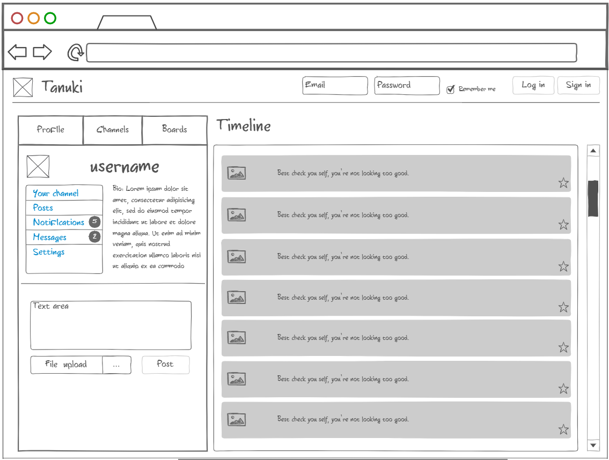
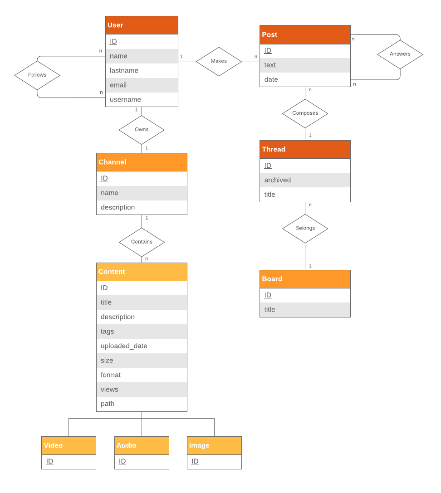
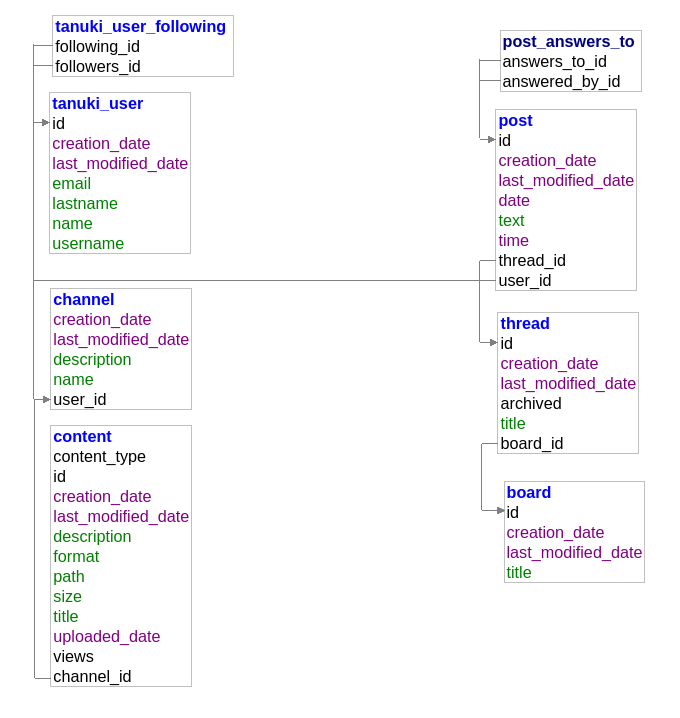

## Tanuki

## Author
- **Nassim Habbash** - _808292_

<center>

</center>

Tanuki is a social platform based on content-sharing. Amidst the variety of social network existing nowadays, Tanuki tries to take a mixed stance between what the ecosystem offers today: it allows for the production and sharing of content (*i.e. videos, images, audio, etc*), and also communication through posts displayed on a timeline.

Each user has its own channel, where they can push content. Content can be of the kinds described above. Users have also the possibility to post. Users can follow other users, and their timeline is made up of the posts of the users they're following. Posts can be either *generic*, and appear in the timeline as normal posts or answers to other posts, or can belong to a board. 
Boards are essentially categories (*i.e. music, literature, etc*). Posts on boards are organized in threads.


<center>

</center>

*Not-so-nice mockup of the homepage*

## Usage

```
$ git clone https://gitlab.com/Dodicin/tanuki
$ cd tanuki
$ docker-compose up
```

The configuration provided in the file `docker-compse.yml` allows to deploy three containers, one for the app itself, one for postgres and one for adminer, a postgres administrating web-tool.

It is possible to run tests by either opening the project on an IDE with Maven and JDK installed, or just with docker by running the following command:

```
$ docker-compose run app mvn verify
```

# Overview

The project itself aims to implement CRUD operations on the main entities that form the system: *Users, Channels, Content, Boards, Posts* and *Threads*.

# Architecture

For the development of the system it has been chosen to use the following tools: the Spring framework to provide flexibility and ease of use, the Hibernate ORM for JPA, Postgres as the DBMS and Maven for dependency management.

# ER schema

The following diagram shows the entities and relationships of the system.
There are in total 5 entities, one being 4 actual entities engaged in an inheritance relationship. There are a total of 7 relationships, two of them being self-relationships on the user entity and post entity, which both have a many-to-many cardinality.

Thus the assignment satisfies requirements **1** and **2** of the assignement.

<center>

</center>

# Database schema

The following is the database schema as it is generated by Hibernate.
<center>

</center>

*Diagram extracted by Adminer*

# Structure

The project provides two configurations, one for a **production** environment and one for a **testing** environment.
These configurations are, respectively under `src.main.resources\application.properties` and `src.test.resources\application.properties`.

The core package that contains all the main classes is `src.main.java.com.web`.

* The `model` package contains all the entities which compose the system:
    * `TanukiUser` represents the user of the platform. It has a many-to-many self-relationship with itself (following/follower), which is handled with Lazy Load.
    * `Channel` represents the place where the user can push content that will be then showcased on the platform. It has a one-to-one relationship with `TanukiUser` which is handled with Lazy Load and `@MapsId`. This means that a channel shares its primary key with its linked user, avoiding us some code and testing thanks to the simplicity of the association.
    * `Content` is the parent entity of `Video`, `Audio` and `Image`. They represent the content that can be pushed on the platform. The inheritance relationship between the four entities has been handled with the Single Table pattern: all the content is effectively on the same table. This has been deemeed the correct choice because of the scarce difference between the attributes of the child entitiy. It is important to note, though, that the child entities are still handled separately on the level of business-logic. This is necessary to implement different solutions based the effective difference between the three media - for example, a `Strategy+Facade` Pattern to enable handling differently the views for each type of media, a video player, an audio player or a simple `` tag.
    * `Post` represents a post by a user on a board. Posts can either be answer to other posts inside threads, or start a new thread on a board themselves. The `Post` entity has a many-to-one relationship with `TanukiUser`. It has also a many-to-many self-relation with itself (answering post) which is handled with Lazy Load and another many-to-one relation with `Thread`.
    * `Threads` represents a unit of discussion, and is formed by a chain of posts. Posts are made inside Threads. The `Thread` entity has a one-to-many relation with `Post`, and a many-to-one relation with `Board`.
    * `Board` represents a container for threads. Different boards may have different themes - for example: cooking, gaming, etc. Threads are created inside Boards. The `Board` entity has a one-to-many relation with `Thread`,

* The `repository` package contains all the repositories for managing persistance and data access of the objects. The interfaces have been implemented through Spring's `JpaRepository`, which defines CRUD operations on each Entity the repository points to. 

Search by criteria operations have been implemented for most entities. Complex searches haven't been implemented, as they lie outside the scope of the project.

The package `src.main.test.java.com.web.tanuki` contains different suits of tests.

* Inside the `repository` folder, all repository have been with **Junit** and **Spring** testing functionalities. 
All the components have been unit tested against their CRUD and search operations. 
The given tests enstablish the correctness of the Entity classes and their respective Repositories.

The tests run on **Junit Jupiter** and **H2 in-memory database**, instead of Postgres, for faster test deployment. 


# Considerations


* Spring has been definitely the highlight of the project, as it allowed for fast and easy development of the system thanks to its vast documentation and community.

* Some more articulate design patterns have been discovered during the development of this project and its tests such as `Factory`, but haven't been implemented due to time constraints. It would be interesting to explore different design patterns to streamline better the testing procedures.

* It is possible to reduce the overhead of the loading of tests significantly by changing Spring's notation to load only the minimum components necessary, but as the study in-depth of Spring's capabilities was outside the scope of the project, this hasn't been done.